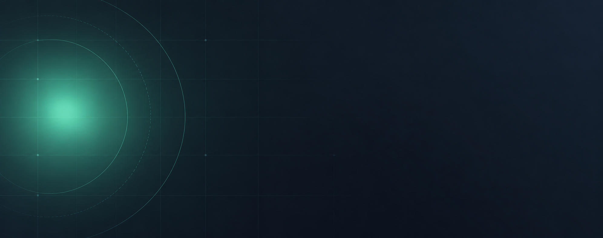
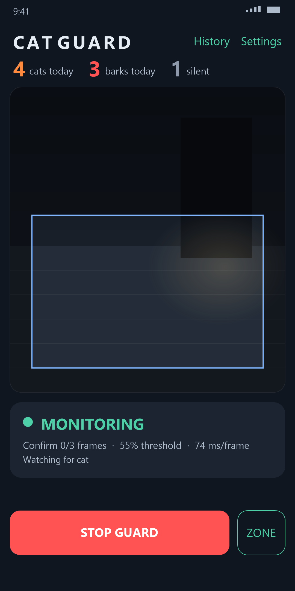
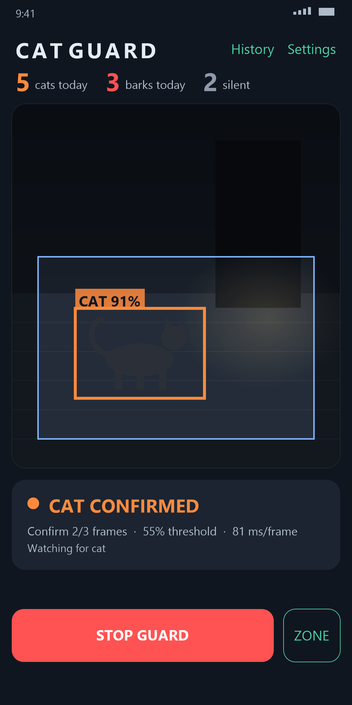
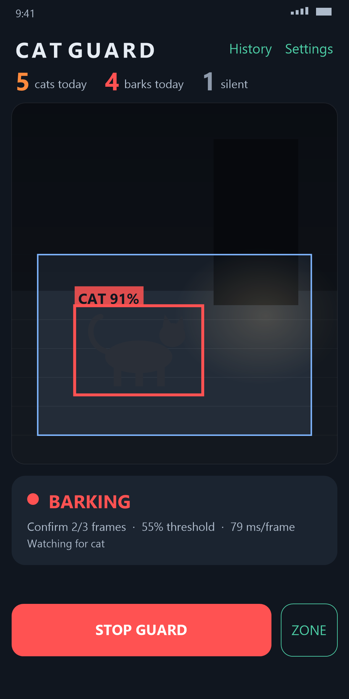
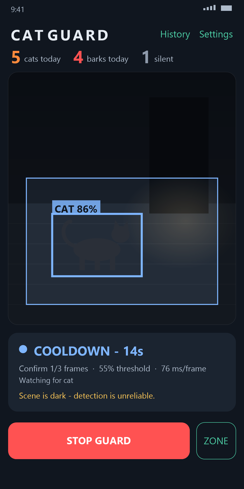
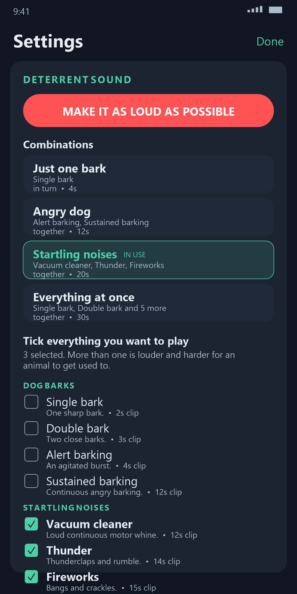
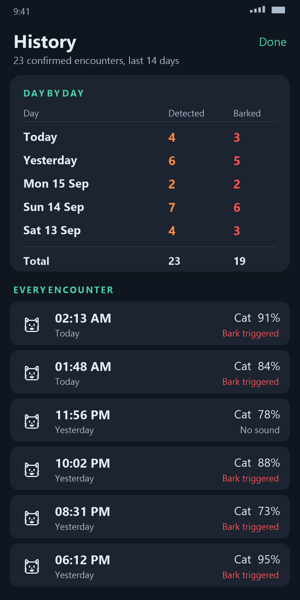
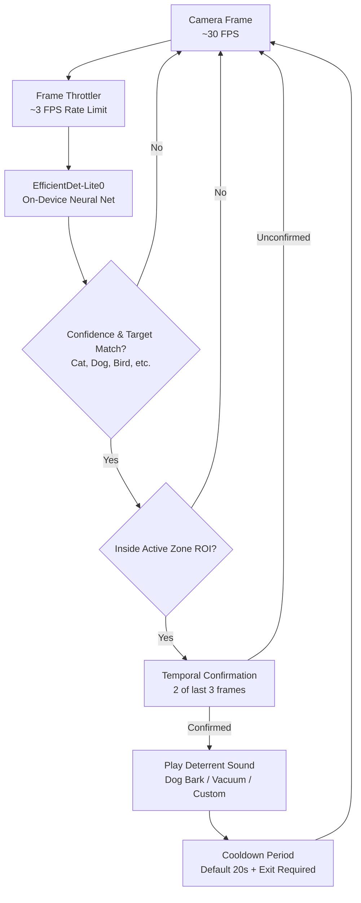

<p align="center">
  
</p>

<p align="center">
  
</p>

<h1 align="center">CatGuard</h1>

<p align="center">
  <strong>Autonomous, 100% Offline AI Cat Deterrent for Android</strong><br>
  <em>Turn any spare Android smartphone into a private, on-device edge vision sentry.</em>
</p>

<p align="center">
  <a href="https://github.com/Maimuzamilhu/CatGuard"></a>
  <a href="https://github.com/Maimuzamilhu/CatGuard"></a>
  <a href="https://github.com/Maimuzamilhu/CatGuard"></a>
  <a href="https://github.com/Maimuzamilhu/CatGuard/blob/main/LICENSE"></a>
  <a href="https://github.com/Maimuzamilhu/CatGuard"></a>
  <a href="https://github.com/Maimuzamilhu/CatGuard/actions/workflows/build.yml"></a>
</p>

<p align="center">
  <a href="https://github.com/Maimuzamilhu/CatGuard/releases/latest">
    
  </a>
</p>

---

## Overview

**CatGuard** repurposes an old, unused Android smartphone into a standalone, autonomous perimeter guardian. 

Mounted on a window sill, patio, or kitchen counter, the phone watches through its camera, runs real-time object detection **strictly on the device**, and plays a natural dog bark whenever an intruding cat enters your designated detection zone. Once startled away, CatGuard enters a quiet cooldown period and resumes sentry duty.

> [!IMPORTANT]
> **Zero Cloud. Zero Accounts. Zero Tracking.**
> CatGuard contains **no `INTERNET` permission** in its `AndroidManifest.xml`. It physically cannot transmit camera frames, telemetry, or metadata to any external server. Everything stays on your phone.

---

## Interface & Live Monitoring

<p align="center">
  
  
  
  
  
  
</p>

<p align="center">
  <em>Live state transitions: Monitoring &rarr; Detection &rarr; Startle Deterrent &rarr; Cooldown &rarr; Sentry Resumption</em>
</p>

---

## Core Features

- 🧠 **On-Device Computer Vision**: Runs Google's **EfficientDet-Lite0** neural network quantized for mobile NPU/CPU. Inference happens locally in tens of milliseconds.
- 🔒 **Absolute Privacy by Construction**: No analytics, no ads, no cloud APIs, and no internet permission. Verified safe for indoor and private garden monitoring.
- 🎯 **Custom Region of Interest (ROI)**: Draw an interactive zone directly over the camera feed. Stray cats walking along the street or birds in trees are ignored.
- ⏱️ **Temporal Confirmation Engine**: Filters out shadows, leaves, and transient artifacts by requiring target presence in **2 of 3 consecutive frames** before sounding an alarm.
- 🔊 **Acoustically Mastered Deterrents**: Bundled real dog recordings high-pass filtered (260 Hz) and EQ-boosted (1.2–4.2 kHz) specifically to maximize phone speaker volume and feline sensitivity without distortion.
- 🔄 **Smart Audio Restoration**: Automatically raises volume for the startle burst and immediately restores your phone's previous volume level.
- 🔋 **24/7 Guard & Thermal Governor**: CameraX foreground service runs indefinitely with the screen locked. The built-in `ThermalGovernor` automatically backs off inference framerate if the device warms up on a hot afternoon.
- 📊 **Daily History**: Keeps bounded on-device logs of daily detection counts and trigger events without needing external databases.

---

## How It Works



---

## Download & Installation

### Option 1: Direct APK Download (Recommended)
1. Download the latest `CatGuard.apk` from [GitHub Releases](https://github.com/OWNER/REPO/releases/latest).
2. On your Android phone, tap the downloaded APK.
3. If prompted, toggle **"Allow installation from this source"** in your phone settings.
4. Open **CatGuard**, grant the Camera permission (and Notification permission on Android 13+).

### Option 2: Sideloading via ADB
```bash
adb install -r CatGuard.apk
```

---

## Quick Start Guide

1. **Mount the Phone**: Place your spare smartphone facing the target area (e.g., kitchen counter, flower bed, porch). Connect a charging cable.
2. **Select Targets**: Open **Settings &rarr; What we detect**. Cats are enabled by default; you can also toggle dogs, birds, or other animals.
3. **Configure Sound**: Select your preferred deterrent bark or sound combination, set the loudness, and tap **TEST SOUND**.
4. **Draw Zone (Optional)**: Tap **ZONE** on the live preview screen and drag the bounding rectangle over the specific area you want to protect.
5. **Start Monitoring**: Tap **START GUARD**. You can turn off or lock the screen; monitoring continues continuously via the background foreground service.

---

## Recommended Hardware & Mounting Setup

| Element | Recommendation | Notes |
| :--- | :--- | :--- |
| **Device** | Any Android phone running Android 7.0 (Nougat) or newer | Quad-core CPU or better handles 3 FPS inference effortlessly. |
| **Power** | Keep connected to a reliable 5V 1A / 2A charger | Continuous camera streaming consumes power; run off mains. |
| **Mounting** | Suction-cup window mount or mini tripod | Aim slightly downward to minimize sky glare and car traffic. |
| **Through Glass** | Position lens flush against window glass | Prevents nighttime indoor reflections from confusing the lens. |
| **Night Monitoring**| Ambient porch light or infrared illuminator | The camera requires enough light to distinguish animal shapes. |

---

## Architecture & Codebase

The codebase follows modern clean architecture with pure Kotlin business logic separated from Android framework APIs:

```
app/src/main/java/com/catguard/
├── MainActivity.kt              # Compose host & service binder
├── camera/
│   ├── CameraSession.kt         # CameraX lifecycle & low-light capture
│   ├── FrameAnalyzer.kt         # Zero-allocation RGBA to upright Bitmap conversion
│   └── SceneBrightness.kt       # Sampled luma calculator for low-light alerts
├── detection/
│   ├── CatDetector.kt           # Model-agnostic detection interface
│   ├── TfLiteCatDetector.kt     # TensorFlow Lite Task Vision implementation
│   ├── AnimalTarget.kt          # Supported COCO species & presentation
│   └── NormalizedBox.kt         # Coordinate normalization & intersection math
├── monitoring/
│   ├── GuardEngine.kt           # Pure Kotlin state machine (Zero Android dependencies)
│   ├── GuardState.kt            # MONITORING → POSSIBLE → CONFIRMED → BARK → COOLDOWN
│   ├── GuardConfig.kt           # Tunable parameters (thresholds, timings, species)
│   ├── ThermalGovernor.kt       # Dynamic rate backoff based on device temperature
│   └── CatGuardController.kt    # Coordinator uniting camera, ML, audio & storage
├── deterrent/
│   ├── AudioController.kt       # Audio playback abstraction
│   ├── SoundPoolAudioController.kt # Low-latency SoundPool playback engine
│   └── DeterrentSound.kt        # Built-in sound library & volume restoration
├── data/
│   ├── SettingsRepository.kt    # Jetpack DataStore persistent preferences
│   ├── EventRepository.kt       # Bounded SQLite / in-memory event logs
│   └── CustomSoundStore.kt      # Private storage manager for user audio
└── ui/
    ├── MainScreen.kt            # Live sentry view, zone editor, daily stats
    ├── SettingsScreen.kt        # Detection sensitivity, volume, species selection
    ├── HistoryScreen.kt         # Daily detection breakdown
    └── ViewportMapping.kt       # Coordinate mapping between preview and ML frame
```

---

## Building from Source

### Prerequisites
- **JDK 17** or **JDK 21** (Eclipse Temurin recommended)
- **Android SDK Platform 35** (`build-tools 35.0.0`)
- Android Studio is **optional** — the project builds entirely via CLI.

### Build Steps

Clone the repository:
```bash
git clone https://github.com/Maimuzamilhu/CatGuard.git
cd "CatGuard"
```

Configure local environment in `local.properties` (if not using default Android SDK path):
```properties
sdk.dir=/path/to/android-sdk
```

Compile the debug APK:
```bash
# On Linux / macOS:
./gradlew assembleDebug

# On Windows (PowerShell):
.\gradlew.bat assembleDebug
```

Run JVM Unit Tests:
```bash
./gradlew testDebugUnitTest
```

The compiled APK will be generated at:
```
app/build/outputs/apk/debug/app-debug.apk
```

---

## Security & Privacy Verification

You can audit the compiled APK at any time to verify that zero network permissions exist:

```bash
aapt2 dump badging app-debug.apk | grep "uses-permission"
```

Output:
```text
uses-permission: name='android.permission.CAMERA'
uses-permission: name='android.permission.FOREGROUND_SERVICE'
uses-permission: name='android.permission.FOREGROUND_SERVICE_CAMERA'
uses-permission: name='android.permission.POST_NOTIFICATIONS'
uses-permission: name='android.permission.WAKE_LOCK'
```

Notice that `android.permission.INTERNET` is **completely absent**. Legacy telephony and storage permissions (`READ_PHONE_STATE`, `READ_EXTERNAL_STORAGE`) are explicitly stripped during manifest merging.

---

## Animal Welfare Note

CatGuard is designed as a **humane, non-violent startle deterrent**.
- The sounds played are natural domestic dog barks or benign startle noises.
- The volume returns to your device's baseline immediately after the sound finishes.
- It does **not** employ ultrasonic frequencies, flashing lasers, or physical deterrents.

---

## Credits & Attributions

### Deterrent Audio
The bundled audio recordings are sourced from Wikimedia Commons under Creative Commons licensing and re-mastered for phone speakers:
- **`dog_bark_short.ogg`** & **`dog_bark_double.ogg`**: by [Amada44](https://commons.wikimedia.org/wiki/User:Amada44) ([CC BY-SA 3.0](https://creativecommons.org/licenses/by-sa/3.0))
- **`dog_bark_alert.ogg`**: by [Armartinell](https://commons.wikimedia.org/wiki/User:Armartinell) ([CC BY-SA 4.0](https://creativecommons.org/licenses/by-sa/4.0))
- **`dog_bark_sustained.ogg`**: by [Nicholas Gemini](https://commons.wikimedia.org/wiki/User:Nicholas_Gemini) ([CC BY-SA 3.0](https://creativecommons.org/licenses/by-sa/3.0))
- Full sound mastering details and third-party notices can be viewed in [CREDITS.md](CREDITS.md).

### Machine Learning Model
- **EfficientDet-Lite0**: Object detection model trained on COCO, published by Google under Apache-2.0 via the TensorFlow Lite Task Library.

---

## License

```text
Copyright 2026 CatGuard Contributors

Licensed under the Apache License, Version 2.0 (the "License");
you may not use this file except in compliance with the License.
You may obtain a copy of the License at

    http://www.apache.org/licenses/LICENSE-2.0
```

Audio assets remain licensed under their respective Creative Commons licenses as detailed in [CREDITS.md](CREDITS.md).
